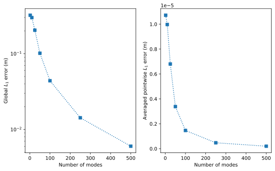

# Summary

Raptor is an efficient Python library for simulating stochastic lack-of-fusion (sLoF) defects in additive manufacturing (AM) processes. These defects arise from stochastic variations in the melt pool boundary leading to undermelting from insufficient overlap between adjacent melt pools or successive layers. Performance variability of AM parts is a pressing challenge in qualification and certification of AM parts; this is in part due to the poorly understood formation rate and statistics of sLoF defects. Raptor is designed to capture the explicit morphologies of sLoF defects and their statistics to accelerate qualification and certification efforts of AM parts in critical applications.

Laser powder bed fusion (LPBF) is a metal AM technique which can produce complex, bespoke parts that are challenging to fabricate using traditional methods. Such components are commonly seen in critical applications, such as topology-optimized parts in the aerospace and defense industries [@chowdhury_review_2019]. A prevalent challenge in the adoption of these parts is their qualification and certification (Q+C) regarding mechanical performance. LPBF has been shown to produce parts with 
poor mechanical performance due to inherent process stochasticity effects on the spread of fatigue life [@berez_fatiguevariation_2022; @reddy_fatigue_2024]. This probability of poor performance remains as a barrier in the Q+C efforts of LPBF-built parts. Recent studies have revealed the role of stochastic defects, specifically sLoF, in reducing performance characteristics of LPBF parts [@miner_lof_2024]. To understand the formation and morphology of sLoF in an already optimized printing regime, a model-based approach must be used to query this space; an experimental approach would result in prohibitively high material costs. For this tangible impact on Q+C activites, Raptor offers a new state-of-the-art in rapid explicit sLoF defect structure prediction. 

# Statement of need
Lack-of-fusion (LoF) defects are a type of defect in LPBF that result from local undermelting caused by insufficient overlap between adjacent melt pools or successive layers [@tang_lof_2017; @gordon_defectstructure_2020]. The analytical prediction of LoF defects commonly relate the melt pool dimensions to spacing parameters chosen before the build [@tang_lof_2017]. Assuming the melt pool is elliptical and defined by its width $W$ and depth $D$, and adjacent melt pools are separated by hatch spacing $H$ and layer thickness $L$, a common criterion used to determine the formation of LoF is given by

\begin{equation}
\left( \frac{L}{D} \right)^2 + \left( \frac{H}{W} \right)^2 \leq 1
\end{equation}

The criterion in Eq. 1 is interpreted as lack-of-fusion occurring when the left-hand-side of the equation is greater than 1. The consolidation of key process parameters such as $W, D, H, L$ into an actionable metric defined on the process space is known as a process map [@gordon_defectstructure_2020]. Criteria such as Eq. 1 can be used to demarcate desirable and undesirable build parameter regions of process space by estimating the formation of LoF defects. As a first approximation, Eq. 1 is a simple and efficient metric that can be used to design process parameter selection against defect structure formation. However, the assumption underlying the simplicity of this criterion is that the melt pool dimensions are constant. Experimental observations [@khairallah_physics_2016; @grasso_insitu_2017; @miner_lof_2024] have clearly shown the melt pool boundary has been observed to be stochastic. The stochasticity in the melt pool is thought to be driven by the interaction of the laser with a non-uniformly packed powder bed and the subsequent coupled thermal-fluid problem [@khairallah_physics_2016]. The computational expense associated with direct numerical simulation (DNS) of these interacting phenomena coupled with uncertainty propagation is prohibitive for the probabilistic simulation of stochastic LoF (sLoF) defects. Melt pool oscillations have been observed to occur on a single track scale [@zafari_xraymeltpool_2025; @derimow_xraymeltpool_2024; @miner_lof_2024]; sLoF defects form from the interaction of multiple tracks and layers, indicating a length and time scale discrepancy that needs to be resolved efficiently to model sLoF.

To improve on the LoF criterion in Eq. 1 and extend it probabilistically, a recent analytical model was developed to include variability in melt pool size [@richter_analyticallof_2025]. Given scan vectors generated by an input hatch $H$, layer thickness $L$ and rotation angle $\theta$, this model defines a unit cell based on the minimum number of interacting scan vectors for an expected melt pool shape. Then, each scan vector was instantiated with a randomly sized constant melt pool to observe the effect of uncertainty on LoF formation. This model revealed the formation of sLoF under uncertainty relative to the criterion in Eq. 1. Although this approach is efficient for large-scale Monte Carlo simulation, only the likelihood of defect formation can be approximated, with no ability to predict defect structure explicitly [@subraveti_lof_2024; @richter_analyticallof_2025].

Explicit sLoF defect structures are necessary for prediction of part properties. The complex structures revealed by [@laleh_sslof_2021] coupled with the critical defect size analysis in [@prithvirajan_criticalpore_2018] indicate the importance of not just sLoF defect formation likelihood, but the quantification of uncertainty in sLoF morphology. The need for a scalable and efficient method to predict explicit sLoF defect structures is emphasized by the recent attribution of fatigue performance drop-off directly to these defect structures [@reddy_fatigue_2024; @miner_lof_2024]. Suppliers of LPBF machines typically recommend process parameters which are optimized against defects, but experiments have shown that “fully-dense” descriptors of processing parameters almost surely produce defects, albeit rarely [@miner_lof_2024]. The tractability of the large-scale probabilistic simulation of these defects is therefore tantamount to the characterization of stochastic defect structure formation and morphology within this space.

In this manuscript, we introduce a significant improvement to state-of-the-art in the prediction and characterization of explicit sLoF defect distributions. The melt pool dimensions are treated as a stochastic process informed by user-supplied data. The stochastic melt pool dimensions are efficiently sampled via a truncated cosine expansion of the full Fourier basis. The locally computed dimensions from the cosine expansion are used to define a Lame curve, which is then used to mask a voxelized grid. The implementation leverages a point-parallel approach, where the independence of each voxel in the domain with any other voxel allows for parallel processing of the masking operation. This paradigm makes probabilistic analyses of explicit sLoF defect structures tractable. Raptor is able to process representative volume elements (RVEs) of edge size 0.5 mm with a resolution of 2.5 µm (8,000,000 voxels) within 1-4 seconds on a local workstation; this RVE simulation can be repeatedly queried to construct an ensemble of 1000 sLoF realizations in under an hour, or an equivalent scanned volume of 125 mm$^3$. The scale of this RVE ensemble is able to capture rare sLoF defect events and is targeted toward simulating defects responsible for deleterious part performance within the optimized printing regime [@reddy_fatigue_2024].

# Software features
The main feature of Raptor is the simulation of stochastic melt pool geometries and the resulting explicit geometries of overlap-induced sLoF defect structures. The implementation utilizes the spectral matching algorithm [@subraveti_sma_2025] to generate stochastic melt pool dimensions in an efficient manner. Raptor allows for a user-input melt pool geometry timeseries, which can be from a variety of sources (experimental measurements, high-fidelity numerical simulations). Different timeseries can be specified for the three supported melt pool dimensions (width, depth, and cap) or can be scaled relative to one another by a scaling factor. To describe the spectral matching algorithm briefly, we consider the case of a single melt pool geometry timeseries for simplicity. 

Let there be an input timeseries containing a melt pool dimension's variation over a specified time interval. The input timeseries is treated as a weakly stationary stochastic process, which loosely states that the given melt pool geometry will fluctuate around its long-term mean with a predictable temporal structure. Raptor performs the fast Fourier transform (FFT) of the timeseries. The resulting Fourier basis is then used to define a cosine expansion (truncated to a user-defined number of modes) to uniquely represent the stochasticity of the melt pool geometry. In this manner, the amplitudes and frequencies in the cosine expansion are tied to physical length and time scales, preserving the statistics of the melt pool fluctuations. To generate stochastic representations of melt pool geometry fluctuations, random phase shifts are introduced to each component of the cosine expansion. This allows for the rapid sampling of the stochastic process by asserting its one-to-one mapping with its spectral representation. An example of the convergence of the number of modes to the input sequence is shown in Fig. 1. Single track scans of Ti6Al4V on a 30 µm powder from [@miner_lof_2024] were used to inform the spectral matching algorithm. The tracks were optically imaged and segmented to obtain the time-varying width. The experimental data shown in Fig. 1 was using $P=370$ W and $V=1.7$ m/s. 

![Comparison of the number of modes used in the cosine expansion with the source experimental single track from [@miner_lof_2024]. The 100-mode expansion has a globally averaged $L_1$ error of 0.0438 $\mu$m.](figures/expansion_example.svg)

The number of modes is an input that is user-defined and can impact the ability of Raptor to capture different frequency ranges of stochastic melt pool fluctuations. Figure 2 shows that as the mode number increases, the global $L_1$ and globally averaged $L_1$ errors converge to 0, indicating that a sufficient number of modes can be selected to represent the information in the process. It is noted that the input data that was used was the single scan from [@miner_lof_2024], and a 0-error reconstruction would use all 30, 000 modes in the FFT of the experimental data; using a smaller number of modes with an acceptable globally averaged $L_1$ error should be a step in the usage of Raptor to ensure proper representation of the stochastic melt pool fluctuations.

Raptor also reads in required scan path information to determine the scan vectors associated with the user-defined domain to be simulated. A scan vector is defined as by the start and end points of a scan path, and along with the known velocity, can be used to resolve the melt pool oscillations. The domain in Raptor is initialized as a voxelized grid with a user-input resolution; the domain can be instantiated with a user-defined size, or Raptor will construct the domain around the given scan path information. Raptor then applies the notion of point-parallel computation, associating each voxel in the domain to the local scan vectors that may interact with the voxel. The voxel-scan vector interactions are determined with a coarse filter step via an axis-aligned bounding box (AABB) and then is further reduced with an oriented bounding box (OBB). The OBB is shown in Figure 3. The AABB is not shown in Fig. 3, but would be parallel to the RVE (box with black edges). The AABB and OBB for each scan vector are computed _a priori_ based on their start and end point. Raptor ensures that stochastic fluctuations of the melt pool are captured by ensuring the size of the bounding boxes are defined by the maximum observed dimensions in the input data for the melt pool fluctuations. By parallelizing the voxel-scan vector interactions through bounding box checks, each subsequent operation is only executed for scan vectors that may interact with a given voxel. 

Once the voxel-scan vector interactions are defined, the time at which the voxel interacts with the scan vector is computed. This time is defined as when the melt pool is expected to pass through the voxel, which can be determined for a local scan vector by the input velocity (from user-defined scan paths) and start and end points of the segment. The cosine expansion is performed at the local time when the melt pool is in the plane of the voxel to determine the melt pool dimensions. Once the local melt pool width, depth, and height are computed from the cosine expansion, the melt pool cross-sectional geometry is computed as the interior of the union of two Lame curves defining the top (height direction) and bottom (depth direction) of the melt pool boundary. The expression for the melting mask defined by a Lame curve is given in Eq. 2. The curve is defined by the local melt pool geometry, with $a=W/2$ and $h$ corresponding to either the depth or the height of the melt pool. The shape parameter $k$ can be changed to vary from bell-shaped ($k\in[0.5,1)$) to parabolic ($k\in[1,2)$) to an ellipse ($k=2$). The height cross section and depth cross section are treated independently and can have different $k$ values, allowing for flexibility in the cross-sectional geometries that can be defined. Additionally, the range that $k$ can take allows for smooth transitions between the different shapes, offering additional control over the melt pool cross-sectional geometry for calibration purposes.

\begin{equation}
\left( \frac{y}{a} \right)^2 + \left( \frac{z}{h} \right)^k \leq 1
\end{equation}

To test if a voxel is inside or outside the local melting mask, the local $(y,z) = (y_l,z_l)$ coordinate of the voxel in the plane of the melt pool is substituted into Eq. 2. If $y_l\geq0$, $h$ is set to the height of the melt pool, and if $y_l<0$, $h$ is set to the depth of the melt pool. If voxel at $(y_l,z_l)$ satisfies Eq. 2, then the voxel is marked as melted. This methodology is visualized on a grid of voxels in Fig. 4 below. The black lines indicate the analytical solution of the boundary of the melt pool (Eq. 2, where the inequality is changed to an equality). The voxels which were melted are colored yellow.

This approach of filtering the relevant scan paths for the locally interacting voxel-scan vector groups lends itself to a parallel approach over the voxels in a domain. Since each voxel only interacts with the melt pools on the associated local scan vectors and not with any other voxel, they can be processed in parallel, with the output of the masking operation being a superposition of the realized stochastic melt pool histories over the voxelized domain. Compared to the time-stepping approach in which a melt pool is translated throughout a domain with a global time counter, the parallel approach offers a significant efficiency gain for the same solution. An example simulation is shown in Fig. 5, with edge length 1 mm and resolution of 2.5 $\mu$m. This simulation had a total of $401^3$ voxels, of which the defect structures occupied 5,788 voxels, resulting in a 0.008% volume fraction. The time for computation was 31.1s on a 2025 M4 Macbook Air with 16GB RAM.

![An RVE with edge length 1 mm at a voxel resolution of 2.5 µm, resulting in $401^3 =64,481,201$ voxels, simulated with nominal spacing parameters for Ti6Al4V and informed by experimental data [@miner_lof_2024].](figures/rve.svg)

To evaluate part-scale builds, a feature was included in Raptor to employ a user-specified sub-volume, referred to as a representative volume element (RVE). The simulation above is an example of Raptor's built-in RVE selection tool.  The RVE domain is a simple rectangular prism, the extents of which are used to down-select the relevant scan path files (say, from a large build). This allows for the efficient analysis of stochastic defect populations in a location-specific manner for application to targeted evaluation of defect structure statistics in critical regions. 

The algorithm used in Raptor can be distilled into a nested loop structure, which will be analyzed here for theoretical performance. For a problem with $n_v$ voxels, there are $n_s$ active scan vectors for which the cosine expansion of $n_m$ modes is computed. In the worst case scenario, every voxel interacts with every scan vector, requiring $$n_vn_sn_m$$ computations to resolve the mask. In practice, for nominal parameters in LPBF Ti6Al4V, $n_s$ is typically between 5 and 9 for AABB, which then falls to 2-3 for OBB. For the mode convergence, the spectral reconstruction with 100 modes results in a globally averaged $L_1$ error of less than 0.5 $\mu$m against the experimental data from [@miner_lof_2024]. Based on these three observations, the computation of the melt pool boundary for the active segments $n_mn_s\approx K$ where $K<<n_v$. Problems can be specified where $K$ and $n_v$ are of the same magnitude by using a large number of modes $n_m$ or a large number of active scan vectors $n_s$. However, these problems tend to be overresolved in the case of large $n_m$. For example, $n_m=100$ results in a reconstruction error of 0.0438 µm, which is two orders of magnitude smaller than the voxel resolution of 2.5 µm. For a large enough $n_s$ to scale with the number of voxels, the voxel resolution must be very coarse. For example, the RVE shown in Fig. 4 had 619 active scan vectors and 64,481,201 voxels. For these to be on the same order, the resolution of the grid would have to be reduced from 2.5 µm per voxel to roughly 117 µm per voxel. Therefore, problems where $K$ and $n_v$ are on the same scale result from poor choices of melt pool resolution or grid resolution and can be considered outside the scope of application for Raptor. It is clear that asymptotically as the problem domain grows larger, that $n_v$ will dominate the computation of the mask since it scales with the cube of edge length. The Raptor masking algorithm therefore scales with $K\mathcal{O}(n_v)$.

An alternate approach to resolving the melting state of each voxel given the same input information would be to explicitly timestep a melt pool mask throughout the domain. This implementation would be a serial algorithm to solve the same masking problem. The same number of computations must be performed as the algorithm implemented in Raptor (as the same voxels must be masked), except the bounding box, spectral expansion, and Lame curve evaluation must be executed at each timestep for $n_t$ total timesteps. This yields a worst-case total computation count of $K\mathcal{O}(n_v)n_t$. The number of timesteps $n_t$ can be thought of as the incremental sum of scan vector lengths divided by local velocity. Total scan distance (given by the sum of the lengths of all scan vectors) will scale with the volume of the simulated domain, i.e. the number of voxels. This implies that $n_t$ is indeed $Rn_v$, where $R$ is some rate at which voxels are melted (as a function of the local velocity of the melt pool). Substituting back in, for the explictly time-stepped implementation, the worst-case total computation count scales with $RK\mathcal{O}(n_v^2)$. This is strictly larger than the parallel implementation $K\mathcal{O}(n_v)$ when the number of voxels is greater than 1 (i.e. for any realistic problem). 

Applications of Raptor to the AM modeling community are numerous, stemming from the potential for rapid probabilistic assessments of defects coupled with their explicit morphologies. Two primary directions of applications are posited: the forward and inverse applications. The forward application would encompass problems such as defect structure prediction at some user-defined process parameters. The user would perform a high-fidelity single/multitrack simulation or characterize a single/multitrack experiment to input to Raptor. Then, the resulting sLoF defect structures and the distributions of the relevant quantities of interest (QoIs) can be constructed. For example, a user may want to simulate sLoF formation at the given process parameters for a sub-region of a build that was determined to undergo extreme loading conditions. The inverse application would include design problems subject to constraints on defect structure distributions and occurrence. As manufacturer-recommended parameters have been shown to still produce rare-event sLoF defects, the inverse problem is highly relevant to exploring the LPBF process space with a clearer view of sLoF defect statistics. An example of an inverse problem would be to minimize defect structure occurrence rate while maximizing build efficiency via spacing parameters.

# Acknowledgements

This manuscript has been authored by UT-Battelle, LLC under Contract No. DE-AC05-
00OR22725 with the U.S. Department of Energy (DOE). The publisher, by accepting the
article for publication, acknowledges that the United States Government retains a non-exclusive,
paid-up, irrevocable, world-wide license to publish or reproduce the published form of this
manuscript, or allow others to do so, for United States Government purposes. The DOE will
provide public access to these results of federally sponsored research in accordance with the
DOE Public Access Plan.
The development of Raptor was sponsored by the DOE Advanced Materials & Manufacturing Technologies Office and utilized resources at the Oak Ridge National
Laboratory Manufacturing Demonstration Facility.
This work was supported by a Space Technology Research Institutes grant from NASA’s Space Technology Research Grants Program under Grant #80NSSC23K1342.

# References
