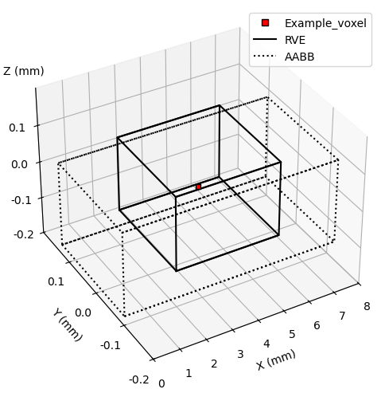
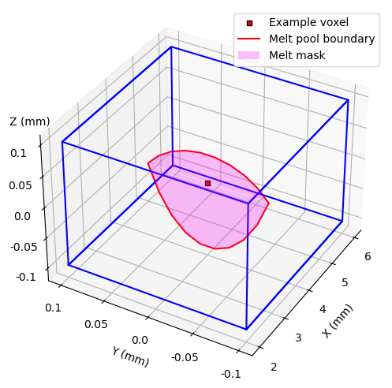
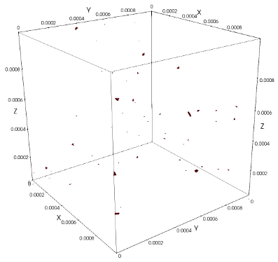

# Summary

Raptor is a computational modeling tool for the simulation of stochastic lack-of-fusion (sLoF) defects in additive manufacturing (AM) processes such as laser powder bed fusion (LPBF). It is a Python library with minimal dependencies that efficiently simulates overlap-induced defects resulting from stochastic variation in the melt pool boundary during LPBF. Raptor is aimed at capturing explicit sLoF defects within optimized LPBF processing regimes, where these defects are exceedingly rare but critical to performance. 

Laser powder bed fusion is a metal AM technique which can produce complex, bespoke parts that are challenging to fabricate using traditional methods. Such parts are commonly seen in critical applications, such as topology-optimized parts in the aerospace and defense industries [@chowdhury_review_2019]. A prevalent challenge in the adoption of these parts is their qualification and certification (Q+C) before and during service. LPBF has been shown to produce parts with variable performance (such as fatigue life) due to inherent stochasticity that is difficult to capture [@berez_fatiguevariation_2022; @reddy_fatigue_2024]. More recent studies have revealed the role of stochastic defects, specifically sLoF, in reducing performance characteristics of LPBF parts [@miner_lof_2024]. To understand the formation and morphology of sLoF in an already optimized printing regime, a model-based approach must be used to query this space; an experimental approach would result in prohibitively high material costs. For this tangible impact on Q+C activites, Raptor offers a new state-of-the-art in rapid explicit sLoF defect structure prediction. 

# Statement of need
Lack-of-fusion (LoF) defects are a type of defect in LPBF that result from local overlap-induced undermelting between adjacent melt pools or successive layers [@tang_lof_2017; @gordon_defectstructure_2020]. The analytical prediction of LoF defects commonly relate the melt pool dimensions to spacing parameters chosen before the build [@tang_lof_2017]. Assuming the melt pool is elliptical, a common criterion used to determine the formation of defects in the process space is 

$$\left( \frac{L}{D} \right)^2 + \left( \frac{H}{W} \right)^2 \leq1.$$

As a first approximation, this LoF criterion is ubiquitous in process maps to inform process parameter design. However, the strong assumption underlying the simplicity of this criterion is that the melt pool dimensions are constant. In experiments, the melt pool boundary has been observed to be stochastic, driven by the interaction of the laser with a non-uniformly packed powder bed and the subsequent coupled thermal-fluid problem [@khairallah_physics_2016; @grasso_insitu_2017; @miner_lof_2024]. The direct numerical simulation of these physics is prohibitive for incorporating stochasticity to infer downstream stochastic LoF (sLoF) defects, due to the stochastic defect structures forming from multiple tracks and layers. 

To improve on the LoF criterion and extend it probabilistically, Richter et al. 2025 developed an analytical method to include variability in melt pool size. This model takes a unit-cell approach where the minimum number of intersecting segments for a certain build condition was computed. Then, each segment was instantiated with a randomly sized constant melt pool to observe the effect of uncertainty on the established criterion. Although this approach is efficient for large-scale Monte Carlo simulation, only the likelihood of defect formation can be approximated, with no ability to predict defect structure explicitly [@richter_analyticallof_2025]. Richter et al. 2025 also note that the time-scaling of this approach is advantageous compared to Tang's model [@tang_lof_2017]. 

In this manuscript, we introduce a significant improvement to state-of-the-art in the prediction and characterization of explicit sLoF defect distributions. The melt pool dimensions are treated as a stochastic process informed by user-supplied data. The stochastic melt pool dimensions are efficiently sampled via a truncated cosine expansion of the full Fourier basis. The locally computed dimensions from the cosine expansion define the control points of a Bezier curve, which is then used to mask a voxelized grid. The implementation leverages a point-parallel approach, where the independence of each voxel in the domain with any other voxel allows for parallel processing of the masking operation. This paradigm grants a significant speedup compared to the serial time-stepping approach, facilitating probabilistic analyses of explicit sLoF defect structures tractable on local workstations.

The need for a scalable and efficient method to predict sLoF defect structures is emphasized by the recent attribution of fatigue performance drop-off directly to these defect structures [@reddy_fatigue_2024; @miner_lof_2024]. Suppliers of LPBF machines typically recommend process parameters which are optimized against defects, but experiments have shown that “fully-dense” descriptors of processing parameters almost surely produce defects, albeit extremely rarely [@miner_lof_2024]. The tractability of the large-scale probabilistic simulation of these defects is therefore tantamount to the characterization of defect structure formation and morphology within this space.

# Software features
The main feature of Raptor is the simulation of stochastic melt pool geometries and the resulting explicit geometries of overlap-induced sLoF defect structures. The implementation utilizes the spectral matching algorithm [@subraveti_sma_2025] to generate stochastic melt pool dimensions in an efficient manner. Raptor allows for a user-input melt pool geometry timeseries, which can be from a variety of high-fidelity sources (experimental measurements, high-fidelity numerical simulations). Different timeseries can be specified for the three supported melt pool dimensions (width, depth, and cap) or can be scaled relative to one another by a scaling factor. To describe the spectral matching algorithm briefly, we consider the case of a single melt pool geometry timeseries for simplicity. 

Let there be an input timeseries containing a melt pool dimension's variation over a specified time interval. The input timeseries is treated as a weakly stationary stochastic process, which loosely states that the given melt pool geometry will fluctuate around its long-term mean with a predictable temporal structure. Raptor performs the fast Fourier transform (FFT) of the timeseries. The resulting Fourier basis is then used to define a cosine expansion (truncated to a user-defined number of modes) to uniquely represent the stochasticity of the melt pool geometry. In this manner, the amplitudes and frequencies in the cosine expansion are tied to physical length and time scales, preserving temporal structure. To generate stochastic representations of melt pool geometry fluctuations while retaining the temporal structure of the fluctuations, random phase shifts are introduced to each component of the cosine expansion. This allows for the quick sampling of the stochastic process by asserting its uniqueness in the frequency domain. An example of the convergence of the number of modes to the input sequence is shown below:

![Comparison of the number of modes used in the cosine expansion with the experimental data [@miner_lof_2024]. The 100-mode expansion has a globally averaged $L_1$ error of 0.0438 $\mu$m.](figures/mode_expansions.png)

Raptor then applies the notion of point-parallel computation, associating each voxel in a user-defined domain to the local scan paths that contain the voxel. The voxel-segment interactions are determined with a coarse filter step via an axis-aligned bounding box (AABB) and then is further reduced with an oriented bounding box (OBB). The AABB and OBB for each segment are computed _a priori_ based on their start and end point as well as the maximum expected melt pool dimensions (based on the user input data). By parallelizing the voxel-segment interactions through bounding box checks, each subsequent operation is only executed for segments that may interact with a given voxel. 

Once the voxel-segment interactions are defined, the time at which the voxel interacts with the segment is computed. This time is defined as when the melt pool passes through the voxel, which can be determined for a local segment by the input velocity (from scan paths) and start and end points of the segment. The cosine expansion is performed at the local time when the melt pool passes through the voxel to determine the melt pool dimensions. Once the local melt pool dimensions are computed from the cosine expansion, they are used to define control points for two Bezier curves describing the boundary of the melt pool depth below the current layer and the melt pool cap above the current layer. The number of points in the Bezier curve is also user-specified.

This approach of filtering the relevant scan paths for the locally interacting voxel-segment groups lends itself to a parallel approach over the voxels in a domain. Since each voxel only interacts with the scan paths and not with any other voxel, they can be processed in parallel, with the output of the masking operation being a superposition of the realized stochastic melt pool histories over the voxelized domain. Compared to the time-stepping approach in which a melt pool is translated throughout a domain with a global time counter, the parallel approach offers a significant efficiency gain for the same solution. An example simulation is shown below, with edge length 1 mm and resolution of 2.5 $\mu$m. This simulation had a total of $401^3=64481201$ voxels, of which the defect structures occupied 5788 voxels, resulting in a 0.008% volume fraction. The time for computation was 31.1s on a 2025 M4 Macbook Air with 16GB RAM.

The above simulation is an example of Raptor's built-in RVE selection tool. To evaluate part-scale builds, a feature was included in Raptor to employ a user-specified sub-volume, referred to as a representative volume element (RVE). The RVE domain is a simple rectangular prism, the extents of which are used to down-select the relevant scan path files (say, from a large build). This allows for the efficient analysis of stochastic defect populations location-specific manner for application to targeted simulation of critical regions. 

The algorithm used in Raptor can be distilled into a nested loop structure, which will be analyzed here for theoretical performance. For a problem with $n_v$ voxels, there are some active segments $n_s$ for which the cosine expansion of $n_m$ modes and Bezier curve computation with $n_b$ points must be performed to obtain the local melt pool mask. In the worst case scenario, every voxel interacts with every segment, requiring 
$$n_vn_sn_mn_b$$
computations to resolve the mask. In practice, we have found that for nominal parameters, $n_s$ is typically between 5 and 9 for AABB, which then falls to 2-3 for OBB. Additionally, very low volume fractions can be resolved with $n_b\in[10,20]$. For the mode convergence, we note that for high-quality experimental data, 100 modes results in a globally averaged $L_1$ error of less than 0.5 $\mu$m. Based on these three observations, we will condense the computation of the melt pool boundary for the active segments $n_mn_bn_s$ as some $K$ where $K<<n_v$. We note that although there may exist problems where $K$ and $n_v$ may be on the same order, these problem are outside the scope of application for Raptor. It is clear that asymptotically as the problem domain grows larger, that $n_v$ will dominate the computation of the mask since it scales with the cube of edge length. This makes intuitive sense, since there are more voxels to compute the local mask for. We will consider the Raptor masking algorithm to scale with $K\mathcal{O}(n_v)$.

Now, let us consider an alternate approach which uses explicit timestepping to evolve the melt pool throughout the domain. This would be a completely serial algorithm to solve the same masking problem. We recognize that we will have the same number of computations as the algorithm implemented in Raptor (as the same voxels must be masked), except now, we must repeat this $n_t$ times to evolve the local melt pool along each track. We now have $K\mathcal{O}(n_v)n_t$. We remark that $n_t$ can be thought of as the incremental sum of scan distances divided by local velocity. Total scan distance will scale with the volume of the simulated domain, i.e. the number of voxels. This leads us to conclude that $n_t$ is indeed $Rn_v$, where $R$ is some rate at which voxels are melted (as a function of the local velocity of the melt pool). Substituting back in, we see that for the serial implementation, we have $RK\mathcal{O}(n_v^2)$ scaling, which is strictly larger than the parallel implementation $K\mathcal{O}(n_v)$ when the number of voxels is greater than 1 (i.e. for any realistic problem). 

Applications of Raptor to the AM modeling community are numerous, stemming from the potential for rapid probabilistic assessments of defects coupled with their explicit morphologies. Two primary directions of applications are posited: the forward and inverse applications. The forward application would encompass problems such as defect structure prediction at some user-defined process parameters. The user would perform a high-fidelity single/multitrack simulation or characterize a single/multitrack experiment to input to Raptor. Then, the resulting sLoF defect structures and the distributions of the relevant quantities of interest (QoIs) can be constructed. For example, a user may want to simulate sLoF formation at the given process parameters for a sub-region of a build that was determined to undergo extreme loading conditions. The inverse application would include design problems subject to constraints on defect structure distributions and occurrence. As manufacturer-recommended parameters have been shown to still produce rare-event sLoF defects, the inverse problem is highly relevant to exploring the LPBF process space with a clearer view of sLoF defect statistics. An example of an inverse problem would be to minimize defect structure occurrence rate while maximizing build efficiency via spacing parameters.

# Acknowledgements

This manuscript has been authored by UT-Battelle, LLC under Contract No. DE-AC05-
00OR22725 with the U.S. Department of Energy (DOE). The publisher, by accepting the
article for publication, acknowledges that the United States Government retains a non-exclusive,
paid-up, irrevocable, world-wide license to publish or reproduce the published form of this
manuscript, or allow others to do so, for United States Government purposes. The DOE will
provide public access to these results of federally sponsored research in accordance with the
DOE Public Access Plan.
This research used resources of the Oak Ridge Leadership Computing Facility (OLCF), supported
by DOE under contract DE-AC05-00OR22725.
This research used resources of the Compute and Data Environment for Science (CADES) at
the Oak Ridge National Laboratory, supported by the Office of Science of the U.S. Department
of Energy under Contract No. DE-AC05-00OR22725.

# References
